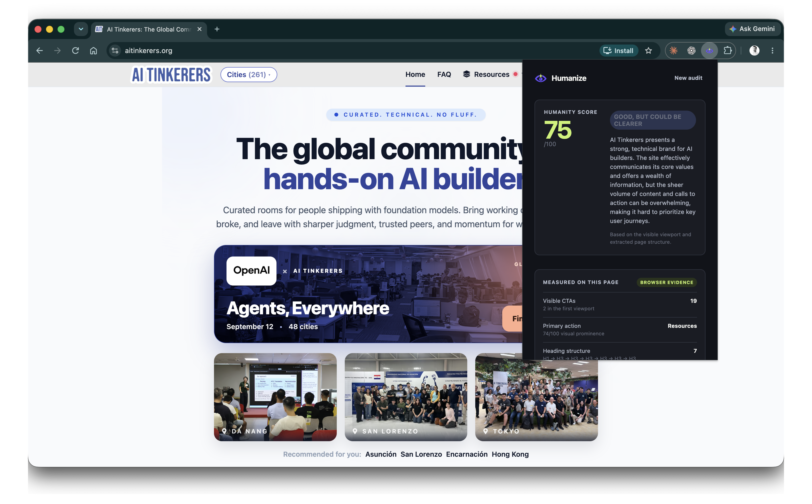
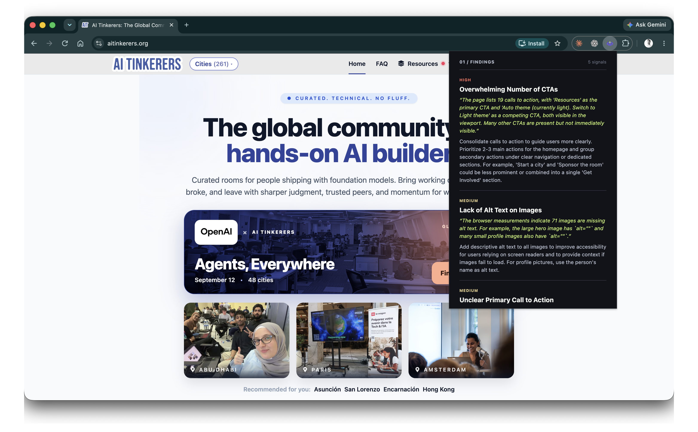
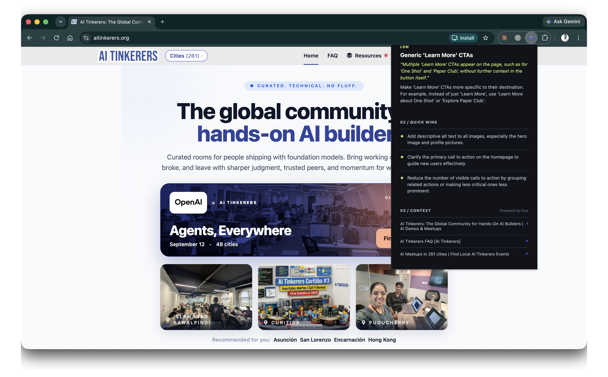
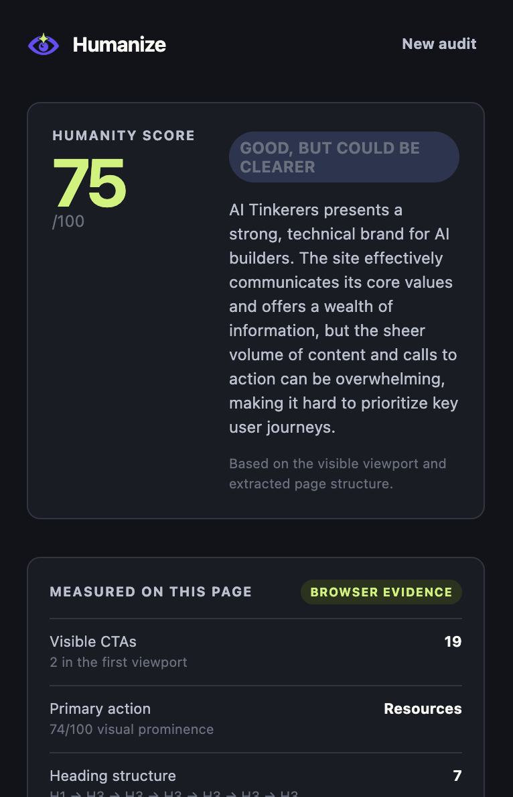

# Humanize AI

> An evidence-first UX review for the page currently open in Chrome.

[](https://github.com/diegoCaceresDev/humanize_ai/releases/latest)
[](https://developer.chrome.com/docs/extensions/develop/migrate/what-is-mv3)
[](https://fastapi.tiangolo.com/)
[](https://neon.com/)

Humanize turns a live web page into a calm, evidence-backed UX review. A reviewer explicitly starts an audit from the Chrome extension; Humanize captures a bounded representation of the active tab, asks the configured model for a structured assessment, and returns a branded report with concrete findings, quick wins, research context, and browser-measured signals.

It is a UX-review tool—not an AI-authorship detector, site editor, or autonomous agent.



## What is included in v0.2.2

- **One-click Chrome audit.** A Manifest V3 extension audits the active HTTP(S) tab only after a reviewer chooses to do so.
- **Bounded, evidence-first capture.** The extension sends a visible JPEG screenshot plus bounded text, headings, links, forms, images, CTA candidates, and accessibility signals. Original image files are never uploaded.
- **Structured AI report.** FastAPI calls OpenRouter server-side and returns a Humanity Score, findings, recommendations, and quick wins.
- **Research grounding.** Exa can add public, relevant sources without blocking the core audit when unavailable.
- **Persistent audit history.** Neon Postgres stores successful audit reports; Alembic manages schema setup.
- **UX Flight Recorder.** The popup shows measured CTA, heading, and accessibility signals from the inspected page.
- **Reversible Focus Preview.** A reviewer may temporarily emphasize the measured primary action and soften competing actions. Humanize adds only its own temporary styling; reverting or refreshing removes it.

## Verified experience

The screenshots below show a completed cloud-backed audit of the public AI Tinkerers homepage. They demonstrate the actual review flow, not a design mockup.

| View | What it demonstrates |
| --- | --- |
| [Audit overview](docs/assets/screenshots/ai-tinkerers-audit-overview.png) | The popup report opens beside the active site with a 75/100 Humanity Score, model summary, and browser-evidence card. |
| [Findings](docs/assets/screenshots/ai-tinkerers-audit-findings.png) | Severity-tagged, evidence-backed findings identify CTA overload, missing image alt text, and an unclear primary action. |
| [Quick wins and context](docs/assets/screenshots/ai-tinkerers-audit-actions-and-context.png) | The report turns findings into concise actions and attaches related public sources discovered through Exa. |
| [Evidence detail](docs/assets/screenshots/ai-tinkerers-audit-evidence-detail.png) | A focused view of the score and deterministic page measurements: visible CTAs, first-viewport CTAs, primary action, and heading structure. |

### Audit overview


### Findings, recommendations, and research context





### Browser evidence



## Architecture

```text
Active Chrome tab
  → Humanize extension popup
  → FastAPI audit service on Render
  → OpenRouter model + optional Exa research
  → Neon Postgres audit record
  → structured report and reversible browser evidence tools
```

The extension has no OpenRouter, Exa, Render, or Neon secret. Provider and database credentials remain server-side.

## Install and test

### Use the release

1. Download or clone [v0.2.2](https://github.com/diegoCaceresDev/humanize_ai/releases/tag/v0.2.2).
2. Run `npm ci` from the repository root.
3. Build the extension:

   ```bash
   npm run package:extension
   ```

4. In Chrome, open `chrome://extensions`, enable **Developer mode**, choose **Load unpacked**, and select `apps/extension/.output/chrome-mv3`.
5. Pin **Humanize AI**, open a normal HTTP(S) page, choose the Humanize icon, and select **Humanize this page**.

The generated ZIP is a release artifact. Chrome’s developer workflow loads the unpacked `chrome-mv3` directory.

### Run against the shared cloud test API

The controlled team test service is available at `https://humanize-api-t9g3.onrender.com`.

1. Copy `apps/extension/.env.cloud.example` to `apps/extension/.env.production`.
2. Confirm the file contains only the public `VITE_API_BASE_URL` value.
3. Run `npm run package:extension` and reload the extension from `apps/extension/.output/chrome-mv3`.
4. Confirm the service before auditing:

   ```bash
   curl https://humanize-api-t9g3.onrender.com/healthz
   curl https://humanize-api-t9g3.onrender.com/readyz
   ```

For local development, follow [Team setup](docs/TEAM_SETUP.md). The complete user test is documented in [Final test](docs/FINAL_TEST.md).

## Configuration and safety

| Concern | Where it belongs |
| --- | --- |
| Public extension API URL | `apps/extension/.env` or `.env.production` as `VITE_API_BASE_URL` |
| OpenRouter credential | Server-side `OPENROUTER_API_KEY` |
| Optional Exa credential | Server-side `EXA_API_KEY` with `EXA_ENABLED=true` |
| Neon connection URLs | Server-side `DATABASE_URL` and `DATABASE_URL_UNPOOLED` |
| Chrome extension CORS policy | Render `ALLOWED_ORIGINS`; lock to known extension IDs before a public launch |

- Audits begin only after an explicit click.
- Treat every captured page as untrusted input; Humanize never follows instructions embedded in page content.
- Do not audit private, confidential, or sensitive pages during team testing.
- The report is advisory. Browser measurements are structural/visual proxies, not proof of conversion, accessibility compliance, or usability outcomes.
- Focus Preview does not edit the target site, save changes, or alter target-site behavior.

## Development and verification

Requirements: Node.js 22+, Python 3.12+, and Google Chrome.

```bash
npm ci
python3 -m venv .venv
source .venv/bin/activate
pip install -r apps/api/requirements.txt
cp .env.example .env
cp apps/extension/.env.example apps/extension/.env

npm run migrate:api
npm run verify
npm run test:api
npm run package:extension
```

Run the API with `npm run dev:api` and the local demonstration page with `npm run dev:demo`.

## Repository map

```text
apps/extension/  Chrome MV3 extension (WXT, React, TypeScript)
apps/api/        FastAPI API, OpenRouter/Exa providers, SQLAlchemy, Alembic
apps/demo/       Local page for predictable audits
docs/            Team, cloud, test, design, and release documentation
render.yaml      Render deployment blueprint
```

## Documentation

- [Team setup](docs/TEAM_SETUP.md)
- [Cloud deployment and team test](docs/CLOUD_TEST_DEPLOYMENT.md)
- [Final user test](docs/FINAL_TEST.md)
- [v0.2.2 release notes](docs/RELEASE_NOTES_v0.2.2.md)
- [UX Flight Recorder plan](docs/UX_FLIGHT_RECORDER_PLAN.md)
- [Design system](docs/HUMANIZE_DESIGN_SYSTEM.md)
- [Changelog](CHANGELOG.md)

## Built during the hackathon

Humanize’s concept, extension, active-tab evidence capture, FastAPI pipeline, OpenRouter/Exa/Neon integration, Signal Violet interface, evidence tools, demo, documentation, and deployment workflow were built during the hackathon. It uses established open-source frameworks and external cloud providers; their services and APIs remain the property of their respective owners.
